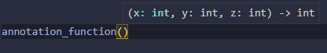

 > This document is for clean code in Python
 >  > referenced in https://doorbw.tistory.com/231

 # *Annotation*
 
 *Annotation*의 사전적 의미는 "주석"

 코드에 대한 추가적인 설명을 이야기 하는 무언가를 의미한다.

Python은 문법의 제약성이 적어 높은 유연성을 가지고 있으나, 그로 인해 발생되는 불편함이 존재한다.

개발할 때 변수나 함수 사용 시 자료형에 대한 선언없이 자유로운 사용을 할 수 있기에 후에 코드를 보게 된다면 해석하기 난해할 수도 있다.

이러한 불편하고 난해한 부분을 완화시켜주기 위해 Python은 Annotation 기능을 제공한다.

Python에서의 **Annotation의 기본 아이디어는 코드를 사용하는 이에게 함수나 클래스에 대해 그 인자값의 형태 또는 반환값을 알려주자는 것이다**.

# *Annotation* 사용법

먼저 annotation은 Python3 이상에서 사용 가능하다. 

또한 Python3.6 이후로는 변수에 대해서도 직접 annotation을 달 수 있다.

어노테이션이 있는 함수를 정의해본다.

```python
def annotation_function(x:int, y:int, z:int) -> int:
    print(x + y + z)
    return x+z
```

다음 함수와 같이 **인자들이 가져야 하는 타입**과 **반환 값의 타입**을 명시할 수 있다.

함수의 annotation은 **\_\_annotaions__** 를 사용하여 확인할 수 있다.
```
print(annotation_function.__annotations__)

{'x': <class 'int'>, 'y': <class 'int'>, 'z': <class 'int'>, 'return': <class 'int'>}
```

다음은 클래스의 인자에 어노테이션을 정의해본다.
```python
class AnnotationClass():
    x : str
    y : int
    z : dict
```
```
print(AnnotationClass.__annotations__)
{'x': <class 'str'>, 'y': <class 'int'>, 'z': <class 'dict'>}
```
함수와 마찬가지로 class의 내부 변수가 어떤 타입을 가져야 하는 지 보다 쉽게 알 수 있다.

# *Anootation* 주의할 점
Python은 Annotation에 대한 강제성이 전혀 없다.

주석이나 **\_\_doc__** 과 같이 안써도 지장없지만, 후에 명시적으로 코드를 파악할 수 있는 좋은 코드를 위해 관리해주는 것이다.

하지만 IDE를 사용할 때에는 Annotation의 장점이 들어난다.



다음 사진은 VSCode를 사용하며 함수를 선언할 때 나타나는 문구로 각 인자에 어떤 타입의 값이 필요하고 어떤 타입의 반환인 지 안내해준다.

# 마무리
지난 번 Docstring 과 같이 Annotation은 함께 일하는 사람들의 이해를 도울 뿐 아니라 내가 사용하고 관리하기 더욱 편리해질 수 있는 좋은 기능이다.

잠깐의 시간을 들여 더 보기 쉽고, 깔끔한 코드를 만들 수 있도록 노력할 것이다.


